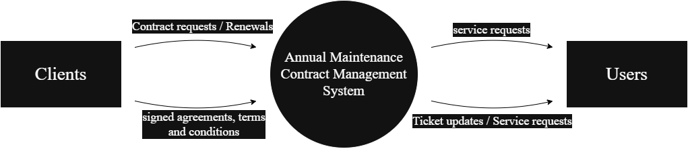

# System Design

This document provides an overview of the system design for the Annual Maintenance Contract Management System, covering its logical and physical design aspects, including Entity-Relationship Diagrams (ERD) and Data Flow Diagrams (DFD).

---

## Logical Design

The logical design focuses on the abstract representation of the system's data flow, structure, and relationships, independent of specific hardware or software implementations. It defines how information moves, is processed, and how different modules interact.

### Entity-Relationship Diagram (ERD)

The ERD illustrates the relationships between key entities in the database.

- **Entities:**  
  Represented by rectangles. Objects or concepts about which information is stored (e.g., Users, Clients, Contracts, Assets, Feedbacks, Renewals, ServiceRequests, Reports).
- **Relationships:**  
  Represented by diamond shapes. Show how entities share information (e.g., a Client has Contracts, a Contract links Assets).
- **Attributes:**  
  Represented by ovals. Characteristics of an entity (e.g., Username for User, CompanyName for Client). Key attributes are underlined.
- **Cardinality:**  
  Specifies the number of instances of one entity that relate to instances of another entity (e.g., One-to-One, One-to-Many, Many-to-Many).

#### Key Relationships

- A **User** can log in and manage various aspects.
- A **Client** can have multiple Contracts.
- A **Contract** can be linked to multiple Assets.
- **ServiceRequests** and **Renewals** are associated with specific Clients and Contracts.
- **Feedbacks** are submitted by Clients.
- **Reports** are generated by the system, often based on data from other tables.

---

## Physical Design

The physical design details the actual input and output processes, how data is input, verified, processed, and displayed. It covers user interface design, data design (how data is represented and stored), and process design (how data moves through the system).

---

## Data Flow Diagrams (DFD)

DFDs visually represent the flow of data within the system.

### Level 0 DFD (Context Diagram)

This is the highest-level view, showing the entire system as a single process and its interactions with external entities.

- **Central Process:**  
  `Annual Maintenance Contract Management System`

- **External Entities:**
  - **Clients:** Initiate contract requests/renewals and receive signed agreements, terms, and conditions.
  - **Users:** Submit service requests and receive ticket updates/service requests.

This diagram provides a broad overview of the system's boundaries and its primary interactions with the outside world.

---

### Level 1 DFD

This level breaks down the single process from Level 0 into major sub-processes and identifies the data stores used by these processes.

- **External Entity:**  
  **Admin** (represents the administrative user interacting with the system)

#### Sub-processes

- **Client Management:** Manages client information.
- **Contract Management:** Manages contracts.
- **Feedback Management:** Handles user feedback.
- **Service Management:** Manages service requests.
- **Renewal Management:** Manages contract renewals.
- **Reports:** Generates various reports.
- **Asset Management:** Manages asset details.

#### Data Stores

- User
- Contract
- Feedback
- ServiceRequests
- Renewal
- Reports
- Assets
- Clients

#### Data Flows

- Admin manages Client Management, Contract Management, Asset Management.
- Admin adds to Feedback Management.
- Admin submits to Service Management.
- Admin applies to Renewal Management.
- Admin views Reports.
- Each management process (Client Management, Contract Management, etc.) stores and retrieves data from its corresponding data store (Clients, Contracts, etc.).
- There are also flows between the User data store and Client Management and Contract Management (implied by the overall system flow).

---
## Contact

For more information or questions regarding the System Design, please contact:

- **Chris Mathew Aje**  
  Email: [chrismaje63@gmail.com](mailto:chrismaje63@gmail.com)  
  Website: [contact.thecma.xyz](https://contact.thecma.xyz)